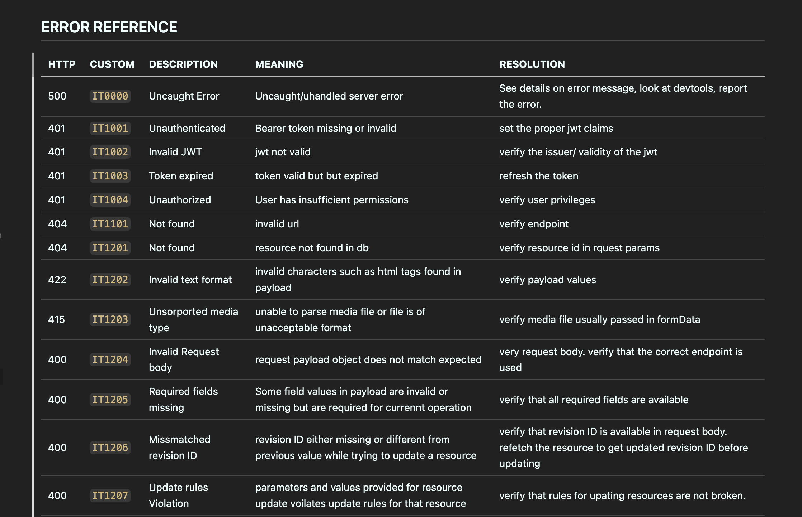

## The Challenge:

Example challenge use case 01:
Without going into much detail about the product we were building unless this becomes a pitching proposal. A unique example  we faced challenges excalating contextual error messages upwards in the stack was placing an order in the database. when a user places an order, the order is created in the database and a payment sequence is initiated and we get this insteresting error message. here's a random sample code that explains this challenge.

<!-- error example -->
	
<!-- {"level":"error","error":"invalid character '<' looking for beginning of value","Debug Error:: ":"invalid character '<' looking for beginning of value","time":"2025-02-05T15:50:27Z","message":"can't bind request body to Map"} -->
	
<!-- Failed starting campay processor: Status: 400 - ApiError 21910: Invalid From and To pair. From and To should be of the same channel (null) More info: -->
<!-- {"level":"error","error":"Status: 400 - ApiError 21910: Invalid From and To pair. From and To should be of the same channel (null) More info: https://www.twilio.com/docs/errors/21910","client_sms_error":{"To":"whatsapp:+237671420884","ContentVariables":"{\"num_of_tickets\":\"1Ticket\",\"event_title\":\"Book Club\",\"reference\":\"CLIQxxxxxxx\",\"download_link\":\"https://cliqkets.com/download/tickets/d43f8ff0-5359-456d-b4f0-cc28e96b5b02\",\"event_date\":\"0001-01-01\"}","From":"MGe085ea715e2481d7d7942068d4052ac6\t","ContentSid":"HX7ed09c6a77cab4eb982a2c2c2987931a"},"time":"2024-12-19T14:32:25Z","message":"Couldn't send sms to client."} -->

Business Logic
<!-- Generic SSA NOTOK -->
```
/internal/buisness/layer/users.go 
    |
    |---> CreateRandomUserOrder(orderArgs)(*randomOrderResponse, error){
        orderResponse, error = persistence.CreateUserOrder(orderArgs)
        if err != nil{
            return nil, err
        }

        pymntResponse, err = payments.initiatePayments(orderResponse)
        if err != nil{
            return nil, err
        }
        return orderResponse, nil
    }
```

Take for example the above code when the caller calls this method via it's handler endpoint and it returns 400 or 500 internal status code with an error message `invalid character '<' looking for beginning of value`. now it's hard to determine if this error message came from when initiating the payment or creating a record in the database or even at the level of the presentation layer when trying to bind the incoming request, however adding some quick `fmt.println` code all over the place to better determine the error message stack but that wasn't helpful


The question we're try to address here is how do we excalate contextual error messages up our architecture stack without much verbosity overhead?

## 1. Starting small, building up:
After facing increasing

Exporting error variables

Each package in our codebase defined its own error variables, often with inconsistent styles.
```
package database

var ErrNotFound = errors.NewValue("record not found")
var ErrMultipleFound = errors.NewValue("multiple records found")
var ErrTimeout = errors.NewValue("request timeout")
```
```
package profile

var ErrUserNotFound = errors.NewValue("user not found")
var ErrBusinessNotFound = errors.NewValue("business not found")
var ErrContextCancel = errors.NewValue("context canceled")
Checking errors with errors.Is() and wrapping with additional context
res, err := repo.QueryUser(ctx, req)
switch {
    case err == nil:
        // continue
    case errors.Is(database.NotFound):
        return nil, errors.Wrapf(ErrUserNotFound, "user not found (id=%v)", req.UserID)
    default:
        return nil, errors.Wrapf(ctx, "failed to query user (id=%v)", req.UserID)
}
```
This helped propagate errors with more detail but often resulted in verbosity, duplication, and less clarity in logs:
internal server error: failed to query user: user not found (id=52a0a433-3922-48bd-a7ac-35dd8972dfe5): record not found: not found

```
/internal/buisness/layer/users.go 
    |
    |---> CreateRandomUserOrder(orderArgs)(*randomOrderResponse, error){
        orderResponse, error = persistence.CreateUserOrder(orderArgs)
        if err != nil{
            return nil, err
        }

        pymntResponse, err = payments.initiatePayments(orderResponse)
        if err != nil{
            return nil, err
        }
        return orderResponse, nil
    }
```

From the use case 01 above adding more information on the returned error using the `fmt.Errorf(``)` would make life much easier right? sure adding more information on the returned error would provide some detail exactly on which part of the application/method the error message was coming from.

- I created a standardized error reference table ( like a DNS routing table borrowing inspiration from the http status codes).
- all error messages are wired up and excalated from the buisness layer.

